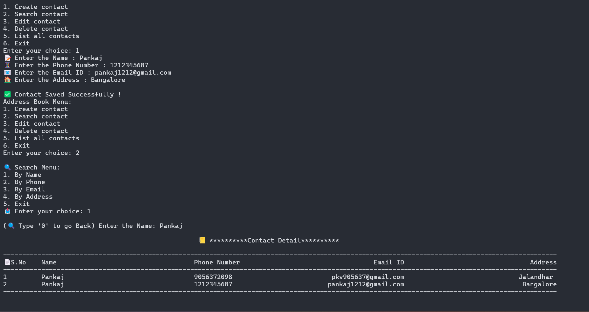

# 📇 Address Book Project (C)


A simple Address Book system written in C that performs contact management using a CSV file (`contact.csv`) for storage.

---

## 🚀 Features

- Add new contacts
- Delete existing contacts
- Edit contact information
- Search contacts by name/number
- Sort contacts
- Validate entries (email, phone, etc.)
- All data stored in a simple `contact.csv` file

---

## 📁 File Structure

| File         | Description                            |
|--------------|----------------------------------------|
| `main.c`     | Main entry point of the program        |
| `contact.*`  | Contact structure and interface        |
| `file.*`     | File read/write operations             |
| `validate.*` | Validation functions                   |
| `edit.*`     | Edit contact details                   |
| `delete.*`   | Delete a contact                       |
| `search.*`   | Search by name, phone, etc.            |
| `sort.*`     | Sort contacts by name or number        |
| `populate.*` | Populate CSV and display contacts      |
| `contact.csv`| Stores the address book data           |

---

## 🔧 How to Compile

Using GCC:

```bash
gcc main.c contact.c file.c validate.c edit.c delete.c search.c sort.c populate.c -o addressbook
./addressbook
```


## 🧪 Sample `contact.csv`

```csv
Name,Phone,Email,Address
John Doe,1234567890,john@example.com,New York
Jane Smith,9876543210,jane@demo.com,California
```

📥 [Download sample CSV](contact.csv)

---

## 📝 License

This project is licensed under the [MIT License](LICENSE).
```
